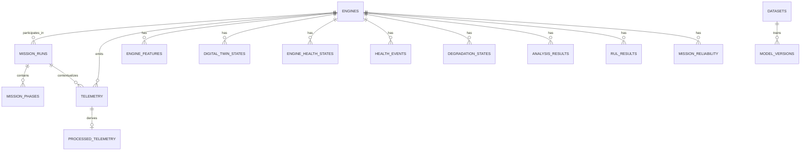

# Entity relationships

Foreign keys use `RESTRICT`, preserving historical data. Raw telemetry is never overwritten; processed values and features have distinct tables and version/provenance fields.
